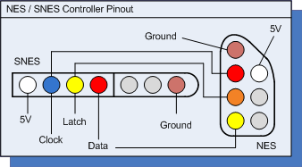

# Whack-a-Mole

**Authors:** Stephanie Shum (stephshum), Hweelin Yeo (hweelin-yeo)

## Introduction

Whack-a-Mole is a hardware game, equipped with a SNES controller and an LED board, where users can “whack” moles. Moles appear on the LED boards randomly and players have to hit the moles in the right position with a hammer, denoted by a green LED pointer, before they disappear to gain a point. Players use the SNES controller to move the hammer around, and click the 'A' button to whack the mole. Once the player reaches 9 points, the game ends.

## Outline
* Introduction
* System Diagram
* Hardware Description
* Detailed Software Description
* Testing
* Results and Challenges
* Work Distribution
* Notes
* References and Credits

## System Diagram
The FRDM-K64F board connects to two peripheral devices: the SNES controller and an Adafruit 16 X 32 RGB LED panel.  These devices are also connected to an external power supply.

The following is a block diagram of our software system:

Figure 1: Schematic Block Diagram

To interact with the SNES Controller and the LED Matrix, we employ the use of libraries to help us communicate between the board and the devices. The RGB_matrix_Panel library allows us to write to and update the display on the matrix. The SNESController library allows the system to take in input from the controller to play the game.

In our game.cpp file, we initialize the LED matrix and the SNES Controller and configure it to the different pins on the board. We used polling in order to retrieve input from the controller. Our decision to use polling was due to the difficulty of implementing interrupts in C++, which we needed to use in order to interact with the RGB_matrix_Panel library. However, the efficiency lost from using polling was minimal, as for our game it wasn't necessary to take in interrupts immediately from the user. We could instead check periodically whether certain buttons were pressed.

## Hardware Description
Here is the Bill of Materials (BoM) for the Whack-A-Mole project:

| Specific Part                                            | Purpose                               | Quantity | Price/Unit | Source/Link                                                                              | Total Price |
|----------------------------------------------------------|---------------------------------------|----------|------------|------------------------------------------------------------------------------------------|-------------|
| W4W Super Nintendo SNES Remote Control - 7 Pin Connector | Controller (take in player’s input)   | 2        | 9.95       | https://www.amazon.com/gp/product/B079SRJWGZ/ref=oh_aui_detailpage_o00_s00?ie=UTF8&psc=1 | 9.95        |
| Adafruit 16 x 32 RGB LED Panel                           | LED Matrix (display moles and hammer) | 1        | 24.95      | https://www.adafruit.com/product/420                                                     | 24.95       |

Figure 2: Bill of Materials (BoM)

The SNES Controller and RGB LED Panel are connected to the ports of the FRDM-K64F board as stated in the block diagram. As both peripheral devices use 5V,  we connected the POWER and GROUND wires of the peripheral devices to a power source.

Due to the large size of the pin outlets of the SNES Controller where conventional wires are too thin to connect it with the FRDM-K64F board, we stripped the external cable of the SNES and soldered the LATCH, DATA, POWER, GROUND and CLOCK wires onto five new wires, which are then used to connect to the respective ports on the FRDM-K64F board. To identify each of the five wires, we attached one end of a voltmeter to the pin outlet of the SNES controller and the other to the end of the cut wires. The following pinout diagram was useful in identifying the wires.

Figure 3: SNES Controller Pinout Diagram

We connected our LED Matrix using jumper wires, as described in the Adafruit tutorial linked in reference. However, the Adafruit tutorial showed how to connect to an Arduino board. Thus, it was necessary for us to also look up diagrams of the FRDM board with the Arduino headers in order to understand where we should place each of the wires.

Figure 4: LED Matrix INPUT Socket and Ribbon Cable

Figure 5: Ribbon Cable Pinout Diagram

Figure 6: FRDM Board and Arduino Headers

## Detailed Software Description
In our game.cpp file, we use several global variables, which include game_state, score, and moleArray. These global variables are important data structure: moleArray is an array of booleans where each boolean reflects the state of whether a mole is there left to be cleared, game_state is an integer that keeps track of the current game state, score is an integer that keeps track of the current score.  

Our game.cpp file runs main(), which calls game_init(). This initializes game state, and would allow for further changes of the game state. After setting the state to GAME_INIT, game_init() calls gamerun().  gamerun() runs on a while loop as long as the game does not end, and in every iteration of the while loop, it checks for the game state. Since the game is first at GAME_INIT, it goes to that case where the game state would then be set GAME_START. At the next iteration of game_update_beta() which checks for the game state again, game_update_beta(), which runs the main logic of the game, is called. game_update_beta() is called continuously in gamerun() until the game ends. We adapted the skeletal game logic from Yue Dongze's project, but since our games is inherently different in nature, the game logic is thought out by ourselves.

Each iteration of game_update_beta() gets and sets data from and onto the peripheral devices after setting a new mole 'scenario'. Setting a new mole 'scenario' means that random numbers, representing specific moles, are generated and used to set the moleArray to the respective booleans, with true meaning that the specific mole is left to be cleared.

We then conduct polling to get input from the SNES controller. Polling is done in a while loop, the end condition being time passed being more than 3 seconds (we keep track of the time passes using a local variable time) and the moleArray have all booleans as false. We then classify input from the SNES controller into two types: direction inout and the 'A' button input. Both of these inputs would result in an update in the other peripheral device: the LED matrix. If there is a direction input on the SNES Controller, the LED matrix gets an update about the update in the position of the cursor. If the A button is clicked where a mole exists, the LED matrix gets an update to make the mole disappear and update the score. At the end of the while loop, polling stops and the mole array will be cleared for the next iteration of game_update_beta() or the end of the game, depending whether the player has "whacked" 9 moles. This is done by calling a function that checks for the score of the player. If that is so, the state will change to GAME_END and the player will win. We created game_update_beta() and the other functions - to check the moleArray, check if player has won and polling function - ourselves. The LED drawing functions are called from the library RGB_matrix_Panel.

We would also like to share our very first implementation of the Whack-A-Mole game, where we implemented the controller not with the SNES controller, but with the switches on the FRDM-K64F board. With that, a very simplified version of Whack-A-Mole was created. SW2, which corresponds to PTC6 and SW3, which corresponds to PTA4, was configured to be GPIO input pin, set up the pull-up resistor and set interrupt on falling edge. The assembly code for NMI handler is also changed to branch to PORTA_IRQHandler, since clicking SW2 goes to NMI handler and initially remains there due to an infinite while loop. Upon every interrupt, the user input is checked to see if they have 'whacked' the right mole, which in this simple game, is not visualised yet - green LED to denote correct answer, and red LED for the wrong answer.

## Testing
Testing was done incrementally to test both peripheral devices.

### RGB LED Matrix Panel

We first tested the RGB LED Matrix Panel to see if we initialized the pins correctly, and if we could draw on the matrix. The program led_test.cpp was loaded onto the FRDM-K64F board. In the main function, we ran simple_test() first, before commenting that out and running harder_test() instead. simple_test() checks for the following:

If the LED panel is connected to the FRDM-K64F board correctly, with its ports initialized correctly
If lights on the LED matrix panel work
If simple_test() does not pass, we know that the problem likely lies in the initialization of the ports, since the LED draw function is documented in a library. We would then check if the wiring of the RGB LED Panel is done correctly to the ports on the FRDM-K64F board that we assigned to. If that is verified, we would check the LED draw function again. After making sure simple_test() passes, we implemented harder_test() that checks for the following:

Draw and clear function for numbers
Draw and clear function for moles
The expected behavior of of  is a mole would appear on the diagram for 5 seconds (5 000 000 microseconds), before it is cleared. Then, numbers from 1 to 9 are displayed, each showing for 5 microseconds before it is cleared. If we do not get our observed behavior, then we know that the functions are not implemented correctly, since we know that the LED matrix panel is initialized correctly based on simple_test().

### SNES Controller

We checked if the SNES controller works with controller_test.cpp. Running this program would check for the following:

If controller pins are initialized correctly to the FRDM-K4F board
If up-down-left-right button and 'A' button works
Polling behavior of controller input
The program runs as follows: poll_input() is called continuously, checking for the all four up-down-left-right button and 'A' button. If a particular button is pressed, a particular drawing will be displayed. If we do not get our observed behavior, then we know that the functions are not implemented correctly, since we know that the LED matrix panel is initialized correctly based on simple_test() in the previous section.

### Game_State

We checked if our game logic works correctly with gamestate_test.cpp. Running this program would check for the following:

If game state initializes correctly
If state ends correctly
The program runs as follows: game is initialized when game_init() is called, and shows a colored '&ast;' on the RGB LED Matrix. The game runs on for approximately 3 minutes before game ends, which calls game_end() to clear the '&ast;'. Thus the expected observation is a colored '&ast;' on the RGB LED Matrix for 3 minutes before it clears.

In hind sight, we could actually have tested the game logic by simply having print statements at each state and running it on terminal, keeping a lookout of the right print statements.

## Results and Challenges

Figure 7: Whack-a-Mole

Our project worked as intended, with the SNES controller in place to control the position of the cursor to get to the moles, as displayed on the RGB LED Matrix Panel. While our game does function as we had proposed, the implementation of our game is slightly different from how we originally planned to implement it in the project proposal.

We had planned to the Adafruit's 16x8 matrix. However, despite studying how to interact with the matrix using I2C, we eventually switched to using the 16x32 matrix, due to better documentation of the matrix by Adafruit. This switch changed a large amount of our implementation. Instead of using the I2C communication that the 16x8 matrix required, we were able to use the RGB_matrix_Panel on the MBED IDE to help us interact with the LED Matrix. However, in order to make this change, we then had to write in C++ instead of using C, as we had originally planned.

Additionally, we had also planned to use the NES Controller in our project proposal. However, due to some worries that the controller was not behaving correctly, we switched intermediately to using the switches (SW2 and SW3) on the board in order to send input. We then wrote a game that used where the player had to click the switch on the correct side in order to "whack" the mole on the correct side. The switches work well, with interrupt handling working at the right place.

After we were able to get this version of the game working, we then decided to try out the new SNES Controller that we had ordered. We were able to find a library on the MBED platform to help us interact with the SNES Controller. Thus, using this controller, we were able to implement the game as we had originally intended.

## Notes
Our code is exported as a uVision project. However, we will be running the original program on the MBED platform.

## References and Credits
Thank you to Professors Bruce Land and Joe Skovira for letting us use their labs and providing us with guidance. Thank you again to Professor Joe Skovira for letting us borrow his 16x32 LED Matrix.

Thank you to Dongze Yue, whose Rhythm Game helped inspire our project. He provided us with resources and links to help us get started after we reached out to him. We adapted some of his code when implementing our game logic.
* https://yuedongze.github.io/projects.html#arm

Thank you to Michael Xiao, whose report helped us understand how to properly connect with the 16x32 LED Matrix. Our function matrix_delay() was written based on the function written on his page to help update the display manually.

* https://confluence.cornell.edu/display/ece3140/Medium+16x32+RGB+LED+matrix+panel

Here is documentation we used to learn about how the LED Matrix works and references to the Adafruit libraries:

* https://learn.adafruit.com/32x16-32x32-rgb-led-matrix/how-the-matrix-works
* https://github.com/adafruit/RGB-matrix-Panel
* https://learn.adafruit.com/adafruit-gfx-graphics-library
* https://learn.adafruit.com/32x16-32x32-rgb-led-matrix/connecting-with-jumper-wires (Figure 4, Figure 5)

Here is documentation we used to learn about the FRDM K64 board:

* http://cache.freescale.com/files/microcontrollers/doc/ref_manual/K64P144M120SF5RM.pdf
* https://os.mbed.com/platforms/FRDM-K64F/ (Figure 6)
* http://cache.freescale.com/files/32bit/doc/user_guide/FRDMK64FUG.pdf

Here is documentation we used to learn about the SNES Controller:

* https://www.igorkromin.net/index.php/2013/02/15/converting-a-snes-controller-to-connect-to-a-nes-controller-port/ (Figure 3)

We used the following libraries for our project. The RGB_matrix_Panel library contained sample code, which we adapted and used in our code:

* https://os.mbed.com/users/foolsday/code/SNESController/
* https://os.mbed.com/teams/EIC_mbed/code/RGB_matrix_Panel/

Below are references to devices (16x8 LED Matrix and NES Controller) that we were planning to use for our project, but ultimately didn't:

* http://www.robot-electronics.co.uk/i2c-tutorial
* http://jcoppens.com/globo/gl_pre/t_common/data/c0302dc.pdf
* https://cdn-shop.adafruit.com/datasheets/ht16K33v110.pdf
* https://learn.adafruit.com/adafruit-led-backpack/1-2-8x8-matrix
* https://www.allaboutcircuits.com/projects/nes-controller-interface-with-an-arduino-uno/
